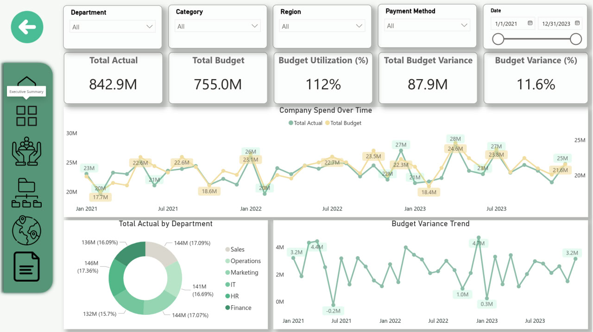
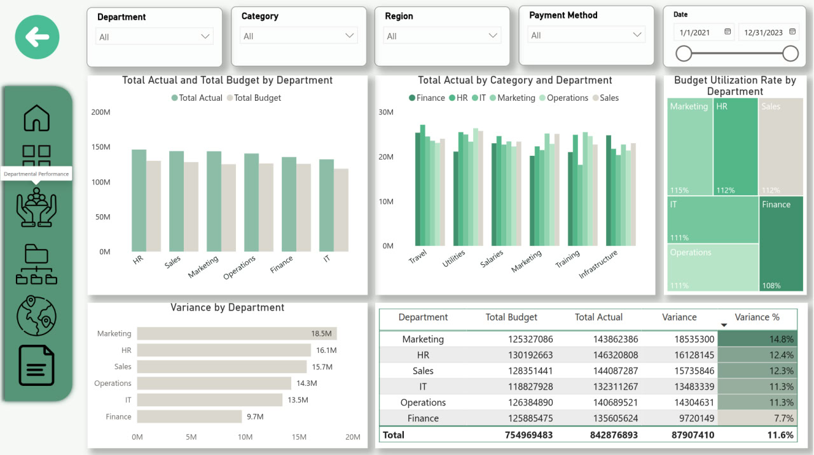
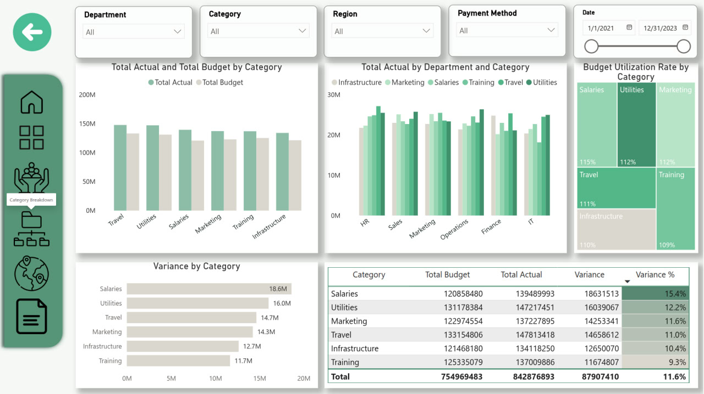
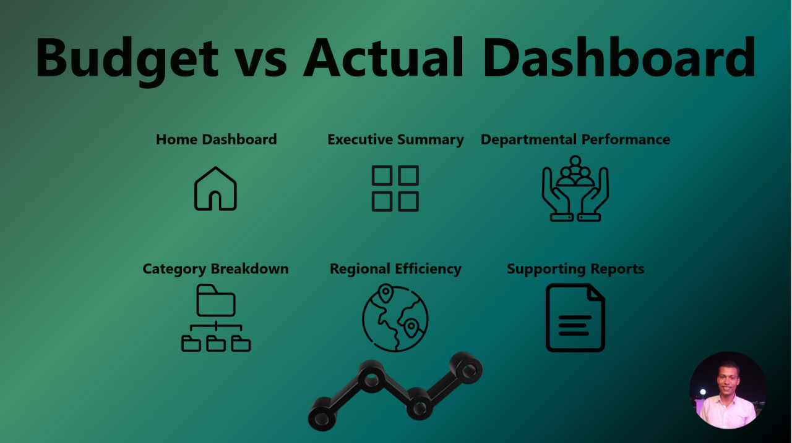

# Budget vs Actual Performance Dashboard 📊

A Power BI dashboard for enterprise budget performance analysis, providing executive-level insights into spending patterns, departmental efficiency, and financial variance across multiple dimensions.

[](https://powerbi.microsoft.com/)
[]()

---

## 📋 Table of Contents

- [Overview](##overview)
- [Key Features](###key-features)
- [Dashboard Pages](##dashboard-pages)
- [Key Insights](##key-insights)
- [Key Metrics & KPIs](##key-metrics--kpis)
- [Business Impact](#business-impact)
- [Screenshots](#screenshots)
- [Contact](#contact)

---

## 🎯 Overview

This Power BI dashboard provides a **360-degree view** of organizational budget performance across a **3-year period (2021-2023)**. The project analyzes **9,500+ financial transactions** across **6 departments**, **6 expense categories**, and **5 regions** to uncover spending patterns, identify budget overruns, and provide actionable recommendations for financial optimization.

### Project Objectives

- ✅ Analyze budget vs actual spending patterns across multiple dimensions
- ✅ Identify departments and categories with highest budget variance
- ✅ Track spending trends over time (monthly, quarterly and yearly)
- ✅ Assess regional efficiency and payment method risks
- ✅ Provide executive-level insights and strategic recommendations
- ✅ Enable data-driven decision making for budget optimization

### Problem Statement

The organization needed to understand why they were consistently over budget and where corrective actions should be focused. Traditional Excel-based reporting was insufficient for multi-dimensional analysis and real-time monitoring.

---

## ⚡ Key Features

### 🎨 Interactive Visualizations
- **Dynamic Filtering:** Filter by Department, Category, Region, Payment Method, and Date Range
- **Cross-Filtering:** All visuals interact with each other for drill-down analysis
- **Conditional Formatting:** Color-coded indicators (Green-scale) for quick status assessment
- **Drill-Through Pages:** Navigate from summary to detailed transaction-level data

### 📊 Comprehensive Analysis
- **5 Main Dashboard Pages:** Home, Executive Summary, Departmental Performance, Category Breakdown, Regional Efficiency
- **Calculated Measures:** DAX-powered metrics for variance, utilization, trends, and forecasts
- **Multi-Dimensional Analysis:** Analyze data across time, department, category, region, and payment method
- **Trend Analysis:** Monthly, Quarterly and yearly trend tracking with variance visualization

### 💼 Executive Reporting
- **Supporting Reports Page:** Detailed written analysis with insights and recommendations
- **KPI Cards:** Real-time monitoring of critical metrics
- **Exception Reporting:** Automatic highlighting of over-budget transactions
- **Export Capabilities:** Share insights via PDF, PowerPoint, or web publishing

---

## 📑 Dashboard Pages

### 1. 🏠 **Home Dashboard**
**Purpose:** Navigation hub with visual overview of all dashboard sections

**Components:**
- Navigation buttons to all dashboard pages
- Quick access menu
- Visual icons for each section

---

### 2. 📈 **Executive Summary**
**Purpose:** High-level overview for C-suite executives and senior management

**KPIs Displayed:**
- Total Actual: **842.9**
- Total Budget: **755.8M**
- Budget Utilization: **112%**
- Total Variance: **87.9M**
- Variance %: **11.6%**

**Visualizations:**
- **Line Chart:** Monthly spending trends (Budget vs Actual)
- **Variance Analysis:** Year-over-year comparison
- **Top-level metrics** with traffic light indicators

**Key Insight:** Company is 12% over budget with systematic overspending across all departments.

---

### 3. 👥 **Departmental Performance**
**Purpose:** Detailed analysis of each department's budget performance

**Visualizations:**
- **Clustered Column Chart:** Budget vs Actual by Department
- **Clustered Column Chart:** Category spending within each department
- **Utilization Rate Treemap:** Visual representation of budget usage
- **Variance Table:** Detailed department-level metrics with conditional formatting

**Departments Analyzed:**
- Finance (7.7% over budget)
- HR (12.4% over budget)
- IT (11.3% over budget)
- Marketing (14.8% over budget - HIGHEST)
- Operations (11.3% over budget)
- Sales (12.4% over budget)

**Key Insight:** Marketing department shows highest variance at 14.8%, requiring immediate attention.

---

### 4. 📦 **Category Breakdown**
**Purpose:** Understand spending patterns across expense categories

**Visualizations:**
- **Clustered Column Chart:** Budget vs Actual by Category
- **Clustered Column Chart:** Department contribution to each category
- **Treemap:** Budget utilization rate by category
- **Detailed Table:** Category-level variance metrics

**Categories Analyzed:**
- Salaries (15.4% over - HIGHEST)
- Utilities (12.2% over)
- Marketing (11.6% over)
- Travel (11.0% over)
- Infrastructure (10.4% over)
- Training (9.3% over)

**Key Insight:** Salaries category shows highest variance, suggesting unplanned hiring or compensation increases.

---

### 5. 🌍 **Regional Efficiency**
**Purpose:** Compare budget performance across geographic regions

**Visualizations:**
- **Clustered Column Chart:** Budget vs Actual by Region
- **Bar Chart:** Variance by Region
- **Donut Chart:** Regional spending distribution
- **Line Chart:** Transaction volume over time by region

**Regions Analyzed:**
- East (20.9M variance - HIGHEST)
- South (19.0M variance)
- Central (17.7M variance)
- West (15.3M variance)
- North (15.1M variance)

**Additional Metrics:**
- Number of Transactions Over Budget: **5,291 (55.8%)**
- Average Monthly Spend by Region
- Payment Method Distribution by Region

**Key Insight:** East region requires immediate intervention with highest variance and transaction volume.

---

### 6. 📄 **Supporting Reports**
**Purpose:** Detailed written analysis with actionable recommendations

**Content:**
- Executive Summary Report
- Root Cause Analysis
- Strategic Recommendations (Immediate, Short-term, Long-term)
- Risk Assessment
- Success Metrics & KPIs
- Implementation Roadmap
- Expected Outcomes

---

## 🔍 Key Insights

### Critical Findings

#### 1️⃣ **Overall Budget Crisis**
- **112% budget utilization** - 12% over budget
- **87.9M total variance** across all operations
- **55.8% of transactions** exceed their budgeted amount
- Only **1 quarter out of 12** came in under budget (Q3 2021)

#### 2️⃣ **Department-Level Issues**
- **All 6 departments** are over budget
- **Marketing leads** with 14.8% overspend (18.5M variance)
- **Finance performs best** but still 7.7% over budget
- No department has achieved budget targets in 3 years

#### 3️⃣ **Category-Specific Problems**
- **Salaries:** 15.4% over budget - suggests unplanned hiring or raises
- **Utilities:** 12.2% over - rising operational costs
- **Marketing:** 11.6% over - potential ad-hoc campaigns without approval
- **Travel:** 11.0% over - weak pre-approval processes

#### 4️⃣ **Regional Performance**
- **East region** is the worst performer (20.9M variance)
- **South and Central** also show concerning patterns
- Regional spending suggests lack of centralized controls

#### 5️⃣ **Payment Method Risks**
- **Card payments** show highest variance (24M)
- Suggests weak pre-approval controls
- **Cash transactions** present fraud risk
- Need for stricter authorization workflows

#### 6️⃣ **The February 2021 Anomaly**
- **Early 2021** showed better budget control with fewer active departments
- Raises question: Does organizational growth erode budget discipline?
- Suggests budget planning hasn't scaled with company growth

#### 7️⃣ **Trend Analysis**
- Budget discipline has **deteriorated from 2021 to 2023**
- Peak variance occurred in Q1 2023 (4.7M)
- No evidence of mid-period budget corrections

---

## 🗂️ Data Model

### Source Data Structure

```
Transaction Table (9,500+ rows)
├── Date (DateTime)
├── Department (String)
│   ├── Finance
│   ├── HR
│   ├── IT
│   ├── Marketing
│   ├── Operations
│   └── Sales
├── Category (String)
│   ├── Infrastructure
│   ├── Marketing
│   ├── Salaries
│   ├── Training
│   ├── Travel
│   └── Utilities
├── Region (String)
│   ├── Central
│   ├── East
│   ├── North
│   ├── South
│   └── West
├── Budget Amount (Currency)
├── Actual Amount (Currency)
├── Payment Method (String)
│   ├── Bank Transfer
│   ├── Card
│   ├── Cash
│   └── UPI
└── Transaction ID (String)
```

### Sample Data

| Date | Department | Category | Region | Budget Amount | Actual Amount | Payment Method | Transaction ID |
|------|------------|----------|--------|---------------|---------------|----------------|----------------|
| 2023-05-11 | Sales | Travel | North | 126,096 | 43,048 | Card | TXN100000 |
| 2023-11-11 | Marketing | Salaries | East | 19,702 | 87,896 | Bank Transfer | TXN100001 |
| 2021-05-02 | IT | Training | Central | 108,523 | 103,632 | Card | TXN100002 |

---

## 📊 Key Metrics & KPIs

### Primary KPIs

| KPI | Formula | Current Value | Target | Status |
|-----|---------|---------------|--------|--------|
| **Budget Utilization %** | (Total Actual / Total Budget) × 100 | 112% | 100% | 🔴 Critical |
| **Total Variance** | Total Actual - Total Budget | +87.9M | 0M | 🔴 Critical |
| **Variance %** | (Variance / Total Budget) × 100 | +11.9% | 0% | 🔴 Critical |
| **Over-Budget Transactions %** | (Over-Budget Count / Total Count) × 100 | 55.8% | <25% | 🔴 Critical |
| **Departments Over Budget** | Count of departments with variance > 0 | 6/6 | 0/6 | 🔴 Critical |

### Secondary Metrics

- **Average Transaction Value:** $89,125
- **Total Transactions:** 9,500+
- **Average Monthly Spend:** $24.7M
- **Peak Spending Month:** January 2023 ($28M)
- **Best Performing Region:** North (lowest variance)
- **Worst Performing Region:** East (highest variance)

---

## 💼 Business Impact

### Problems Solved

✅ **Eliminated Excel Hell:** Replaced 50+ manual Excel reports with 1 interactive dashboard  
✅ **Real-Time Visibility:** Executives now see budget performance in real-time vs monthly reports  
✅ **Root Cause Identification:** Pinpointed exact departments, categories, and regions causing overruns  
✅ **Data-Driven Decisions:** Enabled evidence-based budget allocation and cost control measures  
✅ **Time Savings:** Reduced monthly reporting time from 40 hours to 2 hours  

### Projected Financial Impact

| Initiative | Timeframe | Expected Savings |
|------------|-----------|------------------|
| Emergency budget controls | Q1 2026 | $20M |
| Department-specific interventions | Q2 2026 | $15M |
| Payment method controls | Q3 2026 | $10M |
| Process redesign & automation | Q4 2026 | $5M |
| **Total Year 1 Savings** | **2026** | **$50M+** |

### Strategic Outcomes

1. **Budget Discipline Culture:** Company-wide awareness of spending accountability
2. **Predictive Analytics:** Ability to forecast variances before they occur
3. **Operational Efficiency:** Streamlined approval processes reduce delays
4. **Executive Confidence:** Board and leadership trust in financial management restored
5. **Competitive Advantage:** Better capital allocation enables strategic investments

---

## 📸 Screenshots

### Executive Summary Page

*High-level KPIs and quarterly spending trends*

### Departmental Performance

*Budget vs Actual comparison by department with utilization rates*

### Category Breakdown

*Expense category analysis with cross-department view*

### Regional Efficiency

*Geographic performance analysis with transaction trends*

### Home Dashboard

*Navigation hub with visual menu*

---
## 📞 Contact

- 💼 LinkedIn: [linkedin.com/in/nour-hatem-](https://linkedin.com/in/nour-hatem-)
- 🌐 Portfolio: [nourhatem.netlify.app](https://nourhatem.netlify.app)
